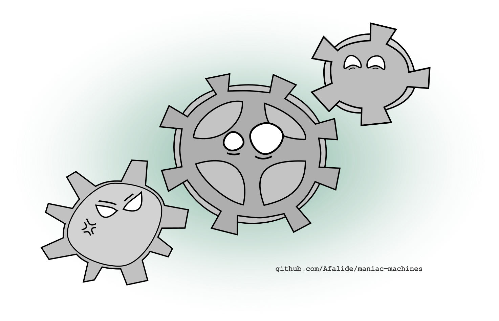

### Maniac Machines

_A (very) stubborn state-machine API_

----------

----------

### What on earth is that?

Maniac Machines is a C++ library for state machines development.
  
If you are unfamiliar with state machines, you should Google that. As a quick description, keep in mind that state machines are devices that store informations in one (generally more) states. Thus by switching state, you modify the behavior of your program.  

State machines are the very base of today's modern computing.

### What are the benfits of using this lib?

This API focuses on code readbility and low-cost maintenance.  
Declaring states, responding to events and performing transitions is made easy.

### Straigthforward example

	TODO: add simple code

